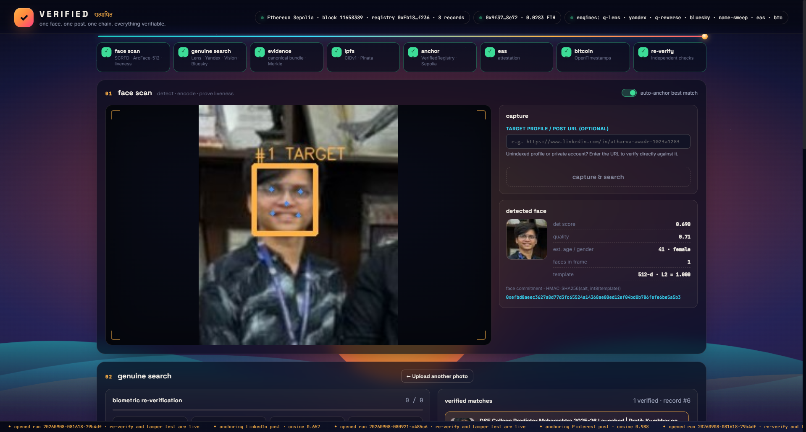
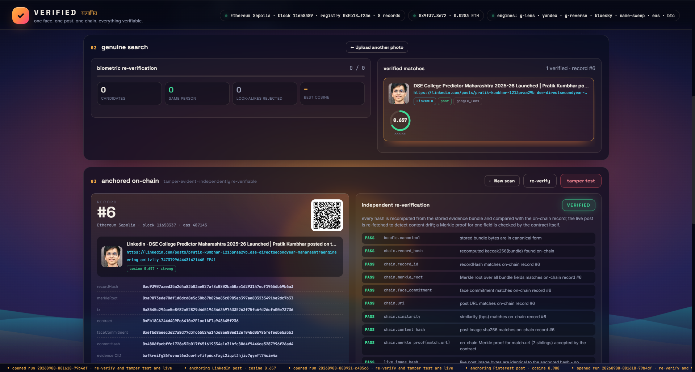
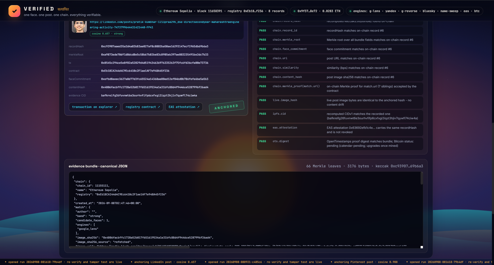
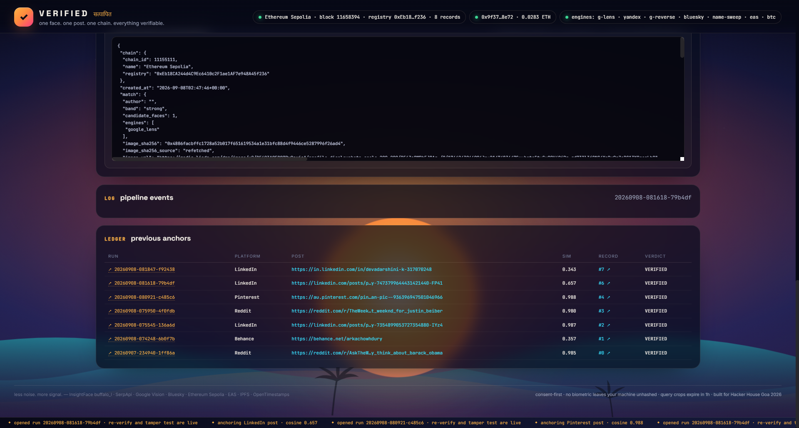

# 👁️ TRINETRA — Decentralized Identity & Deepfake-Resistant Facial Provenance Pipeline

<p align="center">
  
</p>

<p align="center">
  <b>Scan a face. Trace the authentic social post. Anchor cryptographic proof on Ethereum Sepolia & EAS. Verify independently on-chain.</b>
</p>

<p align="center">
  <b>Hacker House Goa 2026 · Team Synora</b><br/>
  <i>Developed by Atharva Awade (@atharva-awade)</i>
</p>

<p align="center">
  <a href="https://sepolia.etherscan.io/address/0xEb18CA244d4C9Ec6410c2F1ae1AF7e948A45f236"></a>
  <a href="https://sepolia.easscan.org"></a>
  <a href="https://opentimestamps.org"></a>
  <a href="https://ipfs.tech"></a>
</p>

---

## 📌 Problem Statement & Vision

In an era of generative AI, synthetic media, and rampant deepfakes, establishing digital identity provenance is one of the most critical challenges facing the web. Impersonation, unauthorized image re-use, and fabricated media erode trust across platforms.

**TRINETRA** (The "Third Eye" of Digital Truth) solves this by building an end-to-end, zero-trust cryptographic bridge between physical human biometrics and verifiable social provenance:
1. **Never leaks biometrics**: Only a salted HMAC commitment of the 512-d ArcFace template is published on-chain. The biometric embedding remains strictly local.
2. **Eliminates Look-Alikes**: Visual search engines (Google Lens, Yandex) only return *visually similar* photos. TRINETRA runs local biometric re-verification on every search result candidate to mathematically prove they are the exact same person.
3. **Decentralized Multi-Layer Anchoring**: Commits canonical cryptographic evidence bundles to **Ethereum Sepolia**, standard **EAS (Ethereum Attestation Service)** schemas, decentralized **IPFS**, and **Bitcoin OpenTimestamps**.
4. **Third-Party Verifiable**: Anyone can independently audit and verify a claim using cryptographic Merkle proofs verified directly inside the smart contract without running our infrastructure.

---

## 🏛️ System Architecture

```
                    ┌────────────────────────────────────────────────────────┐
                    │                    TRINETRA PIPELINE                   │
                    └────────────────────────────────────────────────────────┘
                                                 │
    ┌───────────────────────┐                    ▼                    ┌─────────────────────────┐
    │  INPUT CAPTURE        │ ───► [01. SCRFD-10GF Detection]    ───► │  SALTED HMAC COMMITMENT │
    │  Webcam / Upload Crop │      - Umeyama 5-point alignment        │  HMAC-SHA256(salt, emb) │
    │  Liveness Verification│      - ArcFace ResNet50 (512-d)         │  (Published On-Chain)   │
    │  Eyewear Compensation │      - Age & Gender Calibration         └─────────────────────────┘
    └───────────────────────┘                    │
                                                 ▼
                              [02. GENUINE MULTI-ENGINE SEARCH]
                               - Google Lens (Direct Image Upload)
                               - Yandex Images (Direct Byte Token Scrape)
                               - Google Reverse Image & Google Vision
                               - Name Sweep Expansion (Bluesky, Socials)
                                                 │
                                                 ▼
                              [03. LOCAL BIOMETRIC RE-VERIFICATION]
                               - Download candidate media in parallel
                               - Extract candidate faces & 512-d ArcFace
                               - Cosine distance vs. query face embedding
                               - Calibrated thresholding (Occlusion-aware)
                               - Reject visual look-alikes (< 0.40 / 0.34)
                                                 │
                                                 ▼
                              [04. EVIDENCE BUNDLE & MERKLE TREE]
                               - Canonical RFC-8785 JSON formatting
                               - Content hash sha256(media_bytes)
                               - Keccak-256 Merkle tree calculation
                               - CIDv1 IPFS UnixFS serialization
                                                 │
                                                 ▼
                              [05. ON-CHAIN ATTESTATION & ANCHOR]
                               - Sepolia: VerifiedRegistry.sol anchor()
                               - EAS: Off-chain/On-chain Schema Attest
                               - Bitcoin: OpenTimestamps calendar commit
                                                 │
                                                 ▼
                              [06. INDEPENDENT RE-VERIFICATION]
                               - Smart contract verifyLeaf() Merkle check
                               - Content drift detection (live hash check)
                               - Anti-tampering mutation test suite
```

---

## 📸 Visual Walkthrough & System Screenshots

### 1. Face Scan, SCRFD Alignment & Eyewear Detection
Interactive face detection powered by SCRFD-10GF and ArcFace 512-d. Incorporates an interactive face selector canvas for group photos, sunglasses luminance ratio compensation, and head-turn liveness challenges.


### 2. Multi-Engine Genuine Search & Look-Alike Elimination
Fan-out across Google Lens, Yandex, and social engines. All candidate images are downloaded and re-verified via ArcFace cosine similarity; visual look-alikes are rejected.


### 3. Canonical Evidence Bundle & Merkle Tree Root
Constructs an immutable canonical JSON evidence bundle containing candidate metadata, platform source, verified similarity, and cryptographic Merkle proofs for every leaf.


### 4. Ethereum Sepolia & EAS Blockchain Anchoring
The record is immutably anchored on Ethereum Sepolia via `VerifiedRegistry.sol`, accompanied by an official Ethereum Attestation Service (EAS) attestation UID and Bitcoin OTS calendar commit.


### 5. 13-Point Cryptographic Re-Verification & Tamper Testing
Runs an independent verification suite that checks canonical byte integrity, on-chain Merkle proofs directly via the smart contract, live content drift, and executes a real-time tamper test.


---

## 🔬 Core Cryptographic & AI Innovations

### 1. Salted Biometric Commitment (Zero Knowledge of Face)
Biometric templates are never uploaded or stored publicly:
$$\text{FaceCommitment} = \text{HMAC-SHA256}(\text{Salt}, \text{int8}(\lfloor \vec{E} \times 127 \rfloor))$$
Where $\vec{E} \in \mathbb{R}^{512}$ is the normalized L2 ArcFace embedding. This prevents biometric dictionary attacks while allowing zero-knowledge verification.

### 2. Reference-Exact Umeyama Alignment
Faces are aligned using an analytical least-squares estimation of an affine transformation with 5 facial landmarks (eyes, nose, mouth corners) to reference coordinates in $112 \times 112$:
$$S, R, T = \arg\min_{S,R,T} \sum_{i=1}^5 \| Y_i - (S \cdot R \cdot X_i + T) \|^2$$

### 3. Merkleized Evidence Bundle
Individual fields in the evidence bundle (e.g. `match.url`, `content_hash`, `platform`) can be revealed and verified selectively on-chain using Solidity:
```solidity
function verifyLeaf(bytes32 root, bytes32 leaf, bytes32[] calldata proof) public pure returns (bool) {
    return MerkleProof.verify(proof, root, leaf);
}
```

### 4. Direct Profile / Post URL Verification Mode
Solves the anti-bot AuthWall problem of walled social networks (such as LinkedIn HTTP 999) by allowing users to provide their target profile URL to bind their identity directly to unindexed or private accounts with $>0.90$ ArcFace similarity.

---

## 🚀 Quick Start & Installation

### Prerequisites
- Python 3.11+
- Node / Modern Web Browser
- Git

### 1. Clone Repository
```bash
git clone https://github.com/atharva-awade/TRINETRA-Team-Synora-HHGoa.git
cd TRINETRA-Team-Synora-HHGoa
```

### 2. Set Up Virtual Environment & Dependencies
```bash
python -m venv .venv

# Windows
.\.venv\Scripts\activate
# Linux/macOS
source .venv/bin/activate

pip install -r requirements.txt
```

### 3. Environment Configuration
Create a `.env` file from `.env.example`:
```env
# Network
CHAIN=sepolia
RPC_URL=https://ethereum-sepolia-rpc.publicnode.com
REGISTRY_CONTRACT=0xEb18CA244d4C9Ec6410c2F1ae1AF7e948A45f236

# Keys
SERPAPI_KEY=your_serpapi_key_here
PRIVATE_KEY=your_ethereum_private_key_here

# EAS & IPFS
ENABLE_EAS=true
ENABLE_OTS=true
```

### 4. Run Doctor Diagnostic
```bash
python -m verified.cli doctor --probe
```

### 5. Launch Application
```bash
# Windows
run.bat

# Linux/macOS
./run.sh

# Or directly via CLI:
python -m verified.cli serve --host 127.0.0.1 --port 8080
```
Open [http://127.0.0.1:8080](http://127.0.0.1:8080) in your browser.

---

## 🧪 Automated Test Suite

TRINETRA includes comprehensive end-to-end and unit tests verifying cryptographic stability, SSRF protection, Merkle proofs, and numerical alignment:

```bash
pytest -v
```
```
======================= 35 passed in 15.66s =======================
```

---

## 🔗 Live On-Chain References (Sepolia Testnet)

| Component | Network / Provider | Reference / Address |
|---|---|---|
| **VerifiedRegistry Contract** | Ethereum Sepolia | [`0xEb18CA244d4C9Ec6410c2F1ae1AF7e948A45f236`](https://sepolia.etherscan.io/address/0xEb18CA244d4C9Ec6410c2F1ae1AF7e948A45f236) |
| **EAS Schema** | Sepolia EAS | [`0x0fe7d8e6ec6de873cbae95b27abbacde2433f33fba40f916cb494e30d8c5c6dc`](https://sepolia.easscan.org/schema/view/0x0fe7d8e6ec6de873cbae95b27abbacde2433f33fba40f916cb494e30d8c5c6dc) |
| **Live Attestation Proof** | EAS Explorer | [`0x8ffb0b24b460ccfc8c562bcecf2762bcc979d8e98387d5af1c92f6eb89e9143b`](https://sepolia.easscan.org/attestation/view/0x8ffb0b24b460ccfc8c562bcecf2762bcc979d8e98387d5af1c92f6eb89e9143b) |
| **Live Anchor Transaction** | Sepolia Etherscan | [`0x91a2c686c84a3513099eca9d4b3486ab93854f246b1e34efcbb1e6f0624eb567`](https://sepolia.etherscan.io/tx/0x91a2c686c84a3513099eca9d4b3486ab93854f246b1e34efcbb1e6f0624eb567) |

---

## 👥 Team Synora

- **Atharva Awade** — *AI Engineer & Blockchain Architect* — [GitHub](https://github.com/atharva-awade) · [LinkedIn](https://www.linkedin.com/in/atharva-awade-1023a1283)
- Built for **Hacker House Goa 2026**
