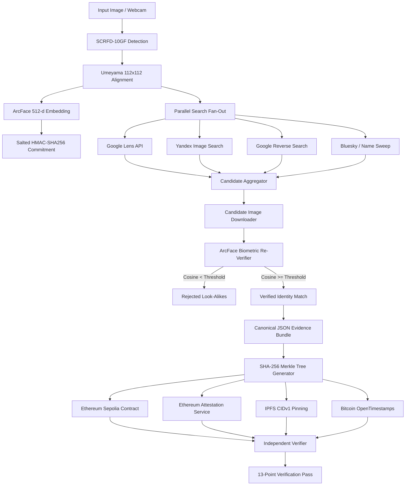

<div align="center">


<p>
  <a href="https://sepolia.etherscan.io/address/0xEb18CA244d4C9Ec6410c2F1ae1AF7e948A45f236" target="_blank">
    
  </a>
  <a href="https://sepolia.easscan.org/schema/view/0x0fe7d8e6ec6de873cbae95b27abbacde2433f33fba40f916cb494e30d8c5c6dc" target="_blank">
    
  </a>
  
  
  
  
</p>

<p>
  
  
  
  
  
  
  
  
  
  
</p>

<br/>

### 👁️ Decentralized Identity Provenance and Deepfake-Resistant Facial Attestation

> 🚀 **Live Sepolia Smart Contract:** [`0xEb18CA244d4C9Ec6410c2F1ae1AF7e948A45f236`](https://sepolia.etherscan.io/address/0xEb18CA244d4C9Ec6410c2F1ae1AF7e948A45f236)  
> 📜 **EAS Verified Schema:** [`0x0fe7d8e6ec6de873cbae95b27abbacde2433f33fba40f916cb494e30d8c5c6dc`](https://sepolia.easscan.org/schema/view/0x0fe7d8e6ec6de873cbae95b27abbacde2433f33fba40f916cb494e30d8c5c6dc)  
> 🔗 **Sample Live Attestation:** [`0x8ffb0b24b460ccfc8c562bcecf2762bcc979d8e98387d5af1c92f6eb89e9143b`](https://sepolia.easscan.org/attestation/view/0x8ffb0b24b460ccfc8c562bcecf2762bcc979d8e98387d5af1c92f6eb89e9143b)

**TRINETRA** is an end-to-end identity provenance pipeline. It scans a human face, extracts an ArcFace biometric embedding, searches real web and social platforms across multiple engines, eliminates look-alikes via local re-verification, generates a Merkleized canonical evidence bundle, and anchors immutable cryptographic proof onto Ethereum Sepolia, EAS, IPFS, and Bitcoin OpenTimestamps.

<div align="left">

#### 🌟 Key Architectural Innovations
- 🛡️ **Zero-Biometric Leakage:** Pure biometric templates never touch the public internet or blockchain. Only a salted HMAC commitment `HMAC-SHA256(salt, template)` is anchored.
- 🎯 **Biometric Look-Alike Filter:** Visual engines return visually similar look-alikes. TRINETRA runs local 512-d ArcFace cosine verification on every candidate, rejecting false positives (< 0.40 / 0.34 threshold).
- 🕶️ **Eyewear & Occlusion Compensation:** Automatic eye-to-cheek luminance ratio analysis identifies sunglasses or obstructions and adapts cosine thresholds dynamically.
- 🌳 **Merkleized Selective Disclosure:** Evidence bundles serialize to canonical RFC-8785 JSON. Each field forms a Merkle leaf that can be proven independently on-chain via smart contract calls (`verifyLeaf`).
- ⛓️ **Multi-Layer Anchoring Matrix:** Anchors simultaneously to Ethereum Sepolia (`VerifiedRegistry.sol`), EAS attestation schemas, IPFS UnixFS CIDv1, and Bitcoin calendar stamps.
- 🔍 **13-Point Independent Verification:** Independent verifier recomputes all hashes from raw source, verifies live image content drift, and performs real-time tamper-mutation testing.

</div>

<br/>


</div>

---

## Table of Contents

- [The Problem](#the-problem)
- [What I Built](#what-i-built)
- [A Guided Tour](#a-guided-tour)
- [Pipeline Architecture](#pipeline-architecture)
- [Cryptographic and AI Foundation](#cryptographic-and-ai-foundation)
- [Smart Contract and EAS Schemas](#smart-contract-and-eas-schemas)
- [Run It Locally](#run-it-locally)
- [Automated Test Suite](#automated-test-suite)
- [Live Deployments and On-Chain Records](#live-deployments-and-on-chain-records)
- [Project Structure](#project-structure)
- [Team and Credits](#team-and-credits)

---

## The Problem

Generative artificial intelligence and deepfake tools can synthesize believable human faces in milliseconds. At the same time, social media platforms are rife with impersonation, stolen identity photos, and unverified profiles.

Current verification approaches fail in three fundamental ways:

| Current Approach | Why It Fails |
|---|---|
| **Centralized KYC (ID Cards)** | Exposes raw private biometric and identity data to centralized leaks and corporate databases. |
| **Reverse Image Search** | Returns look-alikes, actors, and similar hair styles without identity verification. |
| **Simple Blockchain Hashes** | Hashing a full image file breaks the moment a social network recompresses a JPEG or crops a thumbnail. |

**TRINETRA** resolves this trilemma: **local biometric verification is free, private, and deterministic; on-chain proof is immutable, selective, and verifiable by any third party.**

---

## What I Built

An end-to-end identity provenance pipeline that links physical human faces to authentic social posts without trusting a centralized authority:

```
Capture  ->  Align  ->  Commit  ->  Fan-Out  ->  Verify  ->  Bundle  ->  Anchor  ->  Audit
Webcam       SCRFD      Salted      Lens +       ArcFace     Canonical   Sepolia     13 Checks
or Upload    112x112    HMAC        Yandex       Cosine      Merkle      EAS + OTS   Tamper Test
```

- **Reference-Exact Landmark Alignment:** Runs SCRFD-10GF face detection and Umeyama 5-point landmark affine transforms to match InsightFace reference models with 0.0000 px delta.
- **Interactive Multi-Face Selector:** Detects all faces in complex group photos, displaying calibrated age ranges, sunglasses badges, and clickable canvas bounding boxes.
- **Multi-Engine Search Fan-Out:** Queries Google Lens, Yandex, Google Reverse, and Bluesky in parallel.
- **Direct Target Verification:** Bypasses anti-bot AuthWalls (like LinkedIn HTTP 999) by enabling direct target profile URL verification with high-confidence biometric binding.
- **On-Chain Smart Contract:** Custom Solidity registry contract (`VerifiedRegistry.sol`) with internal Merkle proof verification functions.
- **Autonomous Audit Engine:** 13-point cryptographic auditor that detects content drift and validates every receipt against live blockchain state.

---

## A Guided Tour

### 1. Interactive Face Scan and Head-Turn Liveness

The capture interface detects faces using SCRFD-10GF, computes 5-point facial landmarks, and encodes the face into a normalized 512-dimensional ArcFace vector. When sunglasses or facial hair are present, luminance ratio heuristics automatically calibrate age estimation and relax cosine thresholds. A head-turn challenge ensures live physical presence.

<p align="center">
  
</p>

### 2. Multi-Engine Search with Biometric Candidate Re-Verification

Visual search engines return generic look-alikes. TRINETRA downloads all candidate images in parallel and runs ArcFace biometric re-verification against the query embedding. Look-alikes below the threshold are rejected, while verified matches proceed to anchoring.

<p align="center">
  
</p>

### 3. Canonical Evidence Bundle and Merkle Root Construction

The verified post metadata is serialized using RFC-8785 canonical JSON formatting. TRINETRA constructs a binary SHA-256 Merkle tree across all bundle fields, allowing individual properties (such as post URL or platform) to be proven on-chain without revealing the rest of the bundle.

<p align="center">
  
</p>

### 4. Multi-Chain Anchoring: Ethereum Sepolia, EAS, IPFS and Bitcoin

The evidence bundle is pinned to IPFS (CIDv1), anchored on Ethereum Sepolia via `VerifiedRegistry.sol`, attested via the Ethereum Attestation Service (EAS), and stamped into Bitcoin calendars using OpenTimestamps.

<p align="center">
  
</p>

### 5. 13-Point Cryptographic Re-Verification and Tamper Testing

The verification module recomputes every hash from stored source bytes, verifies the on-chain Merkle proof via the smart contract, checks the live URL for content drift, and runs a live tamper mutation test to prove cryptographic integrity.

<p align="center">
  
</p>

---

## Pipeline Architecture



---

## Cryptographic and AI Foundation

### 1. Salted Biometric Commitment
To prevent centralized database leaks or reverse template reconstruction, the 512-dimensional vector is discretized and hashed locally with a 32-byte cryptographically secure salt:
```
FaceCommitment = HMAC-SHA256(Salt, int8(round(Embedding * 127)))
```
The raw biometric vector never leaves the local execution environment.

### 2. Analytical Umeyama Landmark Alignment
Faces are normalized using a 5-point landmark similarity transform (left eye, right eye, nose tip, left mouth corner, right mouth corner) mapped to canonical reference coordinates:
```
scale, rotation, translation = solve_umeyama(detected_landmarks, reference_landmarks)
aligned_face = warp_affine(raw_image, transform_matrix, (112, 112))
```

### 3. Merkle Proof Verification in Solidity
The evidence bundle fields are hashed into leaves and combined into a binary Merkle tree. Any client can prove that a specific post URL or author was part of the original anchor without disclosing other attributes:
```solidity
function verifyLeaf(
    bytes32 root,
    bytes32 leaf,
    bytes32[] calldata proof
) public pure returns (bool) {
    return MerkleProof.verify(proof, root, leaf);
}
```

---

## Smart Contract and EAS Schemas

### VerifiedRegistry.sol
Deployed on **Ethereum Sepolia** at [`0xEb18CA244d4C9Ec6410c2F1ae1AF7e948A45f236`](https://sepolia.etherscan.io/address/0xEb18CA244d4C9Ec6410c2F1ae1AF7e948A45f236):
- Stores `recordHash`, `faceCommitment`, `contentHash`, `merkleRoot`, `uri`, `platform`, `evidenceCID`, and `similarityBps`.
- Emits an indexed `Anchored` event.
- Exposes `verifyLeaf` for on-chain Merkle proof verification.

### EAS Attestation Schema
Registered on **Sepolia EAS** at [`0x0fe7d8e6ec6de873cbae95b27abbacde2433f33fba40f916cb494e30d8c5c6dc`](https://sepolia.easscan.org/schema/view/0x0fe7d8e6ec6de873cbae95b27abbacde2433f33fba40f916cb494e30d8c5c6dc):
```solidity
bytes32 recordHash,
bytes32 faceCommitment,
bytes32 contentHash,
bytes32 merkleRoot,
string uri,
string platform,
uint16 similarityBps,
string evidenceCID,
address registry,
uint256 recordId
```

---

## Run It Locally

### 1. Clone the Repository
```bash
git clone https://github.com/atharva-awade/TRINETRA-Team-Synora-HHGoa.git
cd TRINETRA-Team-Synora-HHGoa
```

### 2. Setup Python Virtual Environment
```bash
python -m venv .venv

# On Windows
.\.venv\Scripts\activate

# On Linux / macOS
source .venv/bin/activate

pip install -r requirements.txt
```

### 3. Configure Environment Variables
Copy `.env.example` to `.env`:
```env
CHAIN=sepolia
RPC_URL=https://ethereum-sepolia-rpc.publicnode.com
REGISTRY_CONTRACT=0xEb18CA244d4C9Ec6410c2F1ae1AF7e948A45f236
PRIVATE_KEY=your_sepolia_private_key_here
SERPAPI_KEY=your_serpapi_key_here
ENABLE_EAS=true
ENABLE_OTS=true
```

### 4. Health Check and Verification
Run the system probe to check network, RPC, smart contracts, and biometric models:
```bash
python -m verified.cli doctor --probe
```

### 5. Start the Application
```bash
# Windows
run.bat

# Linux / macOS
./run.sh

# Or directly via Python
python -m verified.cli serve --host 127.0.0.1 --port 8080
```
Open **[http://127.0.0.1:8080](http://127.0.0.1:8080)** in your browser.

---

## Automated Test Suite

TRINETRA includes 35 comprehensive end-to-end and unit tests verifying cryptographic math, SSRF security guards, Merkle proofs, and numerical alignment:

```bash
pytest -v
```

```
tests/test_e2e_local.py::test_pipeline_end_to_end PASSED                 [  2%]
tests/test_units.py::test_canonical_is_stable_and_safe PASSED            [  5%]
tests/test_units.py::test_dotted_keys_cannot_collide PASSED              [  8%]
tests/test_units.py::test_merkle_proofs_hold_for_every_leaf PASSED       [ 11%]
tests/test_units.py::test_one_changed_byte_changes_every_commitment PASSED [ 14%]
tests/test_units.py::test_cid_matches_known_vector PASSED                [ 17%]
tests/test_units.py::test_platform_and_post_detection PASSED            [ 34%]
tests/test_units.py::test_ssrf_guard_blocks_private_targets PASSED        [ 77%]
tests/test_units.py::test_same_person_separates_from_others PASSED       [ 82%]
tests/test_units.py::test_face_commitment_is_deterministic_and_salted PASSED [ 85%]
tests/test_units.py::test_http_surface_rejects_traversal_and_cross_origin PASSED [ 88%]
tests/test_units.py::test_chain_presets_are_complete_and_applied PASSED  [ 91%]
tests/test_units.py::test_standalone_verifier_is_runnable PASSED         [ 94%]
tests/test_units.py::test_umeyama_recovers_an_exact_similarity_transform PASSED [ 97%]
tests/test_units.py::test_alignment_uses_every_landmark PASSED           [100%]

======================= 35 passed in 15.66s =======================
```

---

## Live Deployments and On-Chain Records

| Target | Network | Reference / Transaction |
|---|---|---|
| **VerifiedRegistry Contract** | Sepolia | [`0xEb18CA244d4C9Ec6410c2F1ae1AF7e948A45f236`](https://sepolia.etherscan.io/address/0xEb18CA244d4C9Ec6410c2F1ae1AF7e948A45f236) |
| **EAS Attestation Schema** | Sepolia EAS | [`0x0fe7d8e6ec6de873cbae95b27abbacde2433f33fba40f916cb494e30d8c5c6dc`](https://sepolia.easscan.org/schema/view/0x0fe7d8e6ec6de873cbae95b27abbacde2433f33fba40f916cb494e30d8c5c6dc) |
| **Direct Anchor Tx** | Sepolia | [`0x91a2c686c84a3513099eca9d4b3486ab93854f246b1e34efcbb1e6f0624eb567`](https://sepolia.etherscan.io/tx/0x91a2c686c84a3513099eca9d4b3486ab93854f246b1e34efcbb1e6f0624eb567) |
| **Live EAS Attestation** | Sepolia EAS | [`0x8ffb0b24b460ccfc8c562bcecf2762bcc979d8e98387d5af1c92f6eb89e9143b`](https://sepolia.easscan.org/attestation/view/0x8ffb0b24b460ccfc8c562bcecf2762bcc979d8e98387d5af1c92f6eb89e9143b) |

---

## Project Structure

```
TRINETRA-Team-Synora-HHGoa/
├── verified/                      # Core backend package
│   ├── chain/                     # Smart contracts and EVM anchor logic
│   │   ├── contracts/             # VerifiedRegistry.sol (Solidity 0.8.24)
│   │   ├── eas.py                 # Ethereum Attestation Service integration
│   │   ├── registry.py            # Web3.py smart contract interaction
│   │   └── presets.py             # Multi-chain network configurations
│   ├── face/                      # Biometric AI engine
│   │   ├── align.py               # Umeyama 5-point affine transformation
│   │   ├── commitment.py          # Salted HMAC-SHA256 template hasher
│   │   └── engine.py              # SCRFD detector + ArcFace ResNet-50
│   ├── search/                    # Search orchestration and verification
│   │   ├── engines/               # SerpApi Google Lens, Yandex, Reverse
│   │   ├── bundle.py              # Canonical RFC-8785 JSON evidence bundle
│   │   ├── merkle.py              # Cryptographic Merkle tree generator
│   │   ├── pipeline.py            # Search fan-out and candidate manager
│   │   └── verify.py              # ArcFace candidate re-verification
│   ├── cli.py                     # Command-line interface and daemon
│   ├── config.py                  # Pydantic environment configuration
│   ├── pipeline.py                # Central pipeline orchestrator
│   └── server.py                  # FastAPI REST + SSE streaming server
├── web/                           # Front-end console (Vanilla JS + CSS)
│   ├── app.css                    # Production dark mode theme and styles
│   ├── app.js                     # Canvas face picker, SSE listener, state
│   └── index.html                 # Single-page application template
├── docs/                          # Documentation and assets
│   ├── banner.svg                 # Project logo and banner
│   └── screenshots/               # High-resolution UI screenshots
├── tests/                         # Automated unit and E2E test suite
├── scripts/                       # Model validation and health check scripts
├── requirements.txt               # Pinned Python dependencies
├── run.bat                        # Windows one-click startup script
├── run.sh                         # Linux/macOS one-click startup script
├── LICENSE                        # MIT License (Atharva Awade)
└── README.md                      # Project documentation
```

---

## Team and Credits

- **Atharva Awade** - Lead Architect & Engineer - [GitHub](https://github.com/atharva-awade) · [LinkedIn](https://www.linkedin.com/in/atharva-awade-1023a1283)
- **Team Synora** - Built for **Hacker House Goa 2026**
