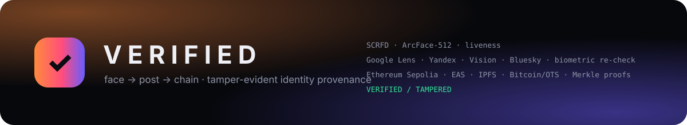

<p align="center">
  
</p>

<h1 align="center">VERIFIED — face → post → chain</h1>
<p align="center"><b>Scan a face. Find the real social post. Anchor tamper-evident proof on Ethereum — and prove it again, independently.</b></p>
<p align="center">Hacker House Goa 2026 · Shortlisting Task #3 · Kale AI Team</p>

---

## What it does

`verified` is an end-to-end **identity-provenance pipeline**:

```
 live webcam / photo ──► 1. FACE SCAN ──► 2. GENUINE SEARCH ──► 3. EVIDENCE ──► 4. ANCHOR ──► 5. RE-VERIFY
                          SCRFD detect      Google Lens · Yandex     canonical      Ethereum       recompute every hash,
                          ArcFace-512       Google Vision · Bluesky  JSON bundle    Sepolia        compare with the chain,
                          liveness check    + biometric re-check     Merkle root    + EAS + IPFS   re-fetch the live post,
                          salted commitment of every candidate       keccak256      + Bitcoin/OTS  on-chain Merkle proof
```

1. **Face scan.** A face is detected with SCRFD-10GF and encoded into a 512-d ArcFace template (InsightFace *buffalo_l*, run directly with ONNX Runtime — no compiled deps). The UI adds a live quality meter and a **head-turn liveness challenge** so a photo held to the camera is not accepted. Only a **salted HMAC commitment** of the template is ever published; the biometric itself never leaves your machine.
2. **Genuine search.** The face crop is submitted to several *real* reverse-image engines in parallel — Google Lens (via SerpApi's image upload), Yandex Images, Google Reverse Image, Google Cloud Vision Web Detection — plus direct social APIs (Bluesky). Nothing is hard-coded: every candidate URL comes back from the engines at run time.
3. **Biometric re-verification (the key idea).** Reverse-image engines return *visually similar* pages. We download every candidate image, detect the faces in it, embed them and compute cosine similarity to the scanned face. Only candidates whose face **is the same person** (cosine ≥ 0.40, calibrated) become *verified matches*; look-alikes are rejected and shown greyed-out for transparency. The person's name is then inferred from web entities / verified titles and used for a second, name-based sweep of social networks — those results are face-verified too.
4. **Evidence bundle.** The chosen post (URL, platform, author, text, timestamp, image URL + SHA-256 of its bytes, similarity, engines, search statistics, face commitment) is serialised as **canonical JSON** (sorted keys, no whitespace). We compute `keccak256(bundle)` and a **Merkle root over every field** so single fields can later be proven on-chain without disclosing the rest.
5. **Anchor.** A Solidity contract, [`VerifiedRegistry`](verified/chain/contracts/VerifiedRegistry.sol), stores `recordHash, faceCommitment, contentHash, merkleRoot, uri, platform, evidenceCID, similarityBps, timestamp, submitter` and emits an `Anchored` event. The bundle is pinned to **IPFS** (Pinata; a CIDv1 is computed locally even without a key), an **Ethereum Attestation Service** attestation is issued with a public schema, and the bundle hash is stamped into **Bitcoin** via OpenTimestamps (free, keyless).
6. **Independent re-verification.** Every hash is recomputed from the stored bundle and compared with the on-chain record; a Merkle proof for `match.url` is checked **by the contract itself** (`verifyLeaf`); the live post image is re-fetched and compared to the anchored `contentHash` (content-drift detection, with a face re-match fallback for CDN re-encodes); the IPFS copy, EAS attestation and OTS proof are checked. A **tamper test** flips one field in the local bundle and shows verification failing check-by-check.

## Which blockchain

**Ethereum Sepolia testnet** (chain id `11155111`) is the primary chain — every anchor is a real transaction you can open on [sepolia.etherscan.io](https://sepolia.etherscan.io). The same record is published three more ways:

| layer | what | where to look |
|---|---|---|
| `VerifiedRegistry.sol` | our own registry contract (`python -m verified.cli deploy`) | Etherscan tx / contract links printed by the pipeline |
| EAS attestation | standard attestation, schema `bytes32 recordHash,bytes32 faceCommitment,bytes32 contentHash,bytes32 merkleRoot,string uri,string platform,uint16 similarityBps,string evidenceCID,address registry,uint256 recordId` | [sepolia.easscan.org](https://sepolia.easscan.org) |
| IPFS | the canonical evidence bundle (CIDv1) | Pinata gateway / any IPFS gateway |
| Bitcoin (OpenTimestamps) | `sha256(bundle)` committed by public calendars into a Bitcoin block | `runs/<id>/ots/bundle.json.ots`, upgraded automatically on re-verify |

Any EVM chain works by changing `RPC_URL / CHAIN_ID / EXPLORER_URL` (and the EAS addresses); the offline test-suite runs the exact same code against a local Anvil node.

## Quick start

Prerequisites: Python 3.10+ (Windows/macOS/Linux), a webcam (optional — you can upload a photo), and two free accounts: [SerpApi](https://serpapi.com) (250 searches/month free) and a Sepolia faucet ([Google Cloud faucet](https://cloud.google.com/application/web3/faucet/ethereum/sepolia), 0.05 ETH/day).

```bash
git clone <this repo> && cd verified
python -m venv .venv && . .venv/bin/activate        # Windows: .venv\Scripts\activate
pip install -r requirements.txt
cp .env.example .env                                # Windows: copy .env.example .env
python -m verified.cli models                       # downloads InsightFace buffalo_l (~275 MB, once)
python -m verified.cli wallet new                   # prints a throwaway testnet address -> fund it at the faucet
#   edit .env: SERPAPI_KEY=...  (optional: GOOGLE_VISION_API_KEY, PINATA_JWT)
python -m verified.cli doctor                       # checks models, keys, RPC, balance, contract
python -m verified.cli deploy                       # deploys VerifiedRegistry to Sepolia (once, ~20 s)
python -m verified.cli serve                        # open http://127.0.0.1:8000
```

Windows one-liner: `run.bat` · macOS/Linux: `./run.sh` · Docker: `docker compose up --build` (the webcam is captured in the browser, so Docker works on any OS).

### CLI

```bash
python -m verified.cli models                          # download the face models (once)
python -m verified.cli doctor                          # models, keys, RPC, wallet, contract
python -m verified.cli wallet new                      # throwaway testnet wallet -> .env
python -m verified.cli deploy                          # deploy VerifiedRegistry -> .env
python -m verified.cli run --image photo.jpg           # full pipeline: scan -> search -> anchor -> re-verify
python -m verified.cli run --image photo.jpg --no-anchor    # search only; anchor later
python -m verified.cli anchor --run <run_id> --match 2 # anchor a specific verified match
python -m verified.cli verify --run <run_id>           # independent re-verification of a stored run
python -m verified.cli tamper --run <run_id>           # alter one field, watch every chain check fail
python -m verified.cli serve                           # the local UI
```

All commands are also available through the `Makefile` (`make setup`, `make doctor`, `make serve`,
`make run IMG=photo.jpg`, `make verify RUN=<id>`, `make tamper RUN=<id>`, `make test`).

Every run writes an auditable folder `runs/<run_id>/` with the query image, face JSON, **raw engine responses**, the canonical bundle, the matched image, anchor receipt, EAS/IPFS/OTS records and the verification report.

## The UI

`python -m verified.cli serve` opens a local, single-page control room — a Goa sunrise that rises as
the pipeline advances (the tide bar and the sun track the eight stages), with no build step and no
external services besides the two web fonts:

* live webcam with detection corners, landmarks, quality bars (sharpness / size / frontal) and the head-turn liveness challenge — the capture button unlocks only when quality and liveness pass;
* engine chips lighting up as Google Lens / Yandex / Vision / Bluesky respond, a streaming grid of candidate faces with their similarity, greens for the same person, greys for rejected look-alikes;
* inferred identity, verified matches with cosine gauges and platform badges, optional manual "Anchor this";
* the on-chain receipt (record id, tx, contract, all hashes, IPFS CID, EAS link, QR code to Etherscan);
* the independent re-verification checklist with a VERIFIED / TAMPERED verdict and a one-click **Tamper test**;
* a ledger of previous anchors, a live ticker of pipeline events, and the raw event log.

Keyboard: `space` captures. Drag-and-drop a photo anywhere on the page to load it.

## Design notes & innovations

* **Verified, not similar.** Reverse-image search alone is noisy; we treat engine output as *candidates* and let the biometric model decide. Bands are relative to `MATCH_THRESHOLD` (default 0.40): *strong* ≥ threshold + 0.10, *match* ≥ threshold, *weak* ≥ threshold − 0.08, else rejected. Measured on the bundled sample photos: same person 0.75–0.97, different people −0.05 … 0.21 — a wide, safe margin.
* **Multi-engine fan-out + identity expansion.** Google Lens (image-upload API, no public URL needed), Yandex (notoriously strong on faces), Google Reverse Image, Vision Web Detection (web entities give the name), and a second sweep by name across Instagram / X / LinkedIn / Facebook / Threads / TikTok / YouTube plus Bluesky's open API. Results are deduplicated by canonical URL and remember every engine that surfaced them.
* **Privacy by construction.** The 512-d template is quantised and committed with `HMAC-SHA256(salt, template)`; only the commitment goes on-chain. The query crop is published to a 1-hour temporary host solely for the engines that need a URL (Google Lens gets a direct upload). Consent-first framing: the intended use is verifying *your own* likeness, detecting impersonation / deepfake reuse, and evidencing authorship.
* **Selective disclosure.** Every bundle field is a Merkle leaf (`keccak256("key=value")`, sorted-pair hashing). `verifyLeaf` lets anyone prove e.g. the URL of the post to a third party without revealing the rest of the evidence — verified by the contract.
* **Defence in depth on the ledger side.** Own registry + EAS standard attestation + IPFS content addressing + a Bitcoin timestamp: four independent ways to check the same 32 bytes.
* **Content drift detection.** Re-verification re-downloads the live post image and compares bytes; if the CDN re-encoded it, the face is re-matched against the stored template so an edit or swap is still caught.
* **Everything auditable.** Raw API responses, the canonical bundle bytes, the tx receipt and each verification report are on disk; `verify` never trusts cached results.

## Architecture

```
verified/
  face/engine.py        SCRFD + ArcFace + gender/age + 106 landmarks (pure onnxruntime), quality, commitment
  search/engines/       serpapi_engines.py (Lens, Yandex, Google reverse, name search) · gvision.py · bluesky.py
  search/verify.py      candidate download + biometric re-verification (thread pool)
  search/metadata.py    oEmbed / OpenGraph / JSON-LD post metadata
  search/pipeline.py    fan-out -> verify -> identity inference -> expansion -> metadata
  chain/contracts/      VerifiedRegistry.sol (+ compiled artifact in chain/artifacts/)
  chain/evidence.py     canonical JSON, keccak record hash, Merkle tree & proofs
  chain/registry.py     web3.py deploy / anchor / verify / verifyLeaf
  chain/eas.py          EAS schema registration + attestation + decode
  chain/ipfs.py         Pinata pinning + local CIDv1
  chain/ots.py          OpenTimestamps stamp / upgrade / status
  pipeline.py           orchestration (scan -> anchor -> verify_run), run folders, events
  server.py             FastAPI + SSE + webcam preview/liveness endpoints
  cli.py                doctor · wallet · deploy · run · verify · tamper · serve
web/                    the UI (index.html, app.css, app.js)
tests/                  offline end-to-end test (real models + real contract on Anvil, fixture SerpApi)
```

## Testing

```bash
pip install -r requirements-dev.txt
python -m pytest tests -q          # 31 tests, no node, no API keys, no network
```

Everything real runs: the ONNX face models, the compiled `VerifiedRegistry`, the canonical-JSON
hashing and the Merkle proofs. Only two things are substituted — the chain is an **in-process
eth-tester chain** (`RPC_URL=tester`, the same web3.py code path; export `ANVIL_RPC=http://127.0.0.1:8545`
to use a real node instead) and the SerpApi HTTP layer is a **local fixture server** whose "visual
matches" point at the bundled sample photos.

The suite asserts, among other things: the same person is matched on the Instagram/Facebook fixtures
and different people are rejected; the anchor verifies end to end; a one-field tamper flips the
verdict to TAMPERED and every affected check to FAIL; Merkle proofs hold for all leaves of bundles
of 1–19 fields and are accepted by the deployed contract; dotted keys cannot collide; the SSRF guard
blocks 13 private-address notations; hostile engine payloads (nulls, wrong types) cannot crash a run;
and the HTTP surface rejects path traversal and cross-origin writes.

## Known limitations

* **Search coverage depends on the engines.** Private accounts and un-indexed photos cannot be found; people with a small public footprint may return zero verified matches (the pipeline then anchors nothing — it never writes unverified claims). Public figures and people with public LinkedIn/Instagram/X photos work best.
* **Engine quotas.** SerpApi's free tier is 250 searches/month (each run uses 3–5). Google Vision is optional. Bing Visual Search is not used because Microsoft retired the Bing Search APIs.
* **Metadata extraction is best-effort.** Instagram/Facebook/LinkedIn hide most data behind login walls; we use oEmbed where it exists (X, YouTube, TikTok, Bluesky, Reddit, Pinterest) and OpenGraph/JSON-LD otherwise, falling back to the engine-provided title.
* **Biometric threshold.** 0.40 cosine on ArcFace is conservative; low-resolution thumbnails may push a true match into the "weak" band (0.32–0.40), visible in the UI but not anchored. Lower `MATCH_THRESHOLD` at your own risk.
* **Liveness is a presentation check, not certified anti-spoofing.** The head-turn challenge defeats a static photo but not a replayed video.
* **Face commitments bind a specific scan.** Two scans of the same person produce different templates, so the commitment proves *which template* a record was built from (verifiable by whoever holds the template + salt), not a searchable biometric index — by design.
* **Testnet.** Sepolia ETH has no value and the network can be slow (~15–30 s per tx). OpenTimestamps proofs become Bitcoin-confirmed only after the calendar's next Bitcoin transaction (minutes to hours); until then they are "pending" — `verify` upgrades the proof in place on every run.
* **The local server trusts the local user.** It binds to `127.0.0.1` by default, guards state-changing endpoints with an `Origin` check and validates run ids, but it has no authentication: do not expose port 8000 to a network you do not trust (the Docker compose file sets `HOST=0.0.0.0` inside the container only).
* **Not a surveillance tool.** There is no bulk mode, no watchlist, no database of faces — one scan, one anchor, and every artefact stays in `runs/`.
* **Temporary image hosting.** For Yandex / Google Reverse Image the query face crop is uploaded to a 1-hour public host (litterbox / tmpfiles / 0x0). Set `IMAGE_HOST=none` to disable those engines and keep everything to direct uploads.

## Responsible use

This is a provenance tool: verify your own likeness, detect impersonation or unauthorised reuse, evidence authorship. Do not use it to identify or track people without their consent; comply with local law (e.g. India's DPDP Act, GDPR biometric rules). The pipeline deliberately publishes no biometric data, keeps raw evidence local, and anchors only face-verified public posts.

## Credits

InsightFace buffalo_l models (Apache-2.0) · SerpApi · Google Cloud Vision · Bluesky AT Protocol · web3.py · Ethereum Attestation Service · Pinata / IPFS · OpenTimestamps · Foundry (tests).

MIT License — Kale AI Team, Kale Logistics Solutions.
